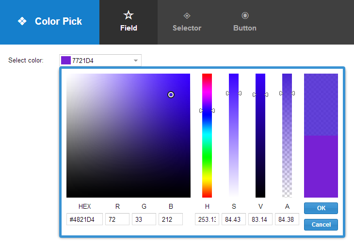
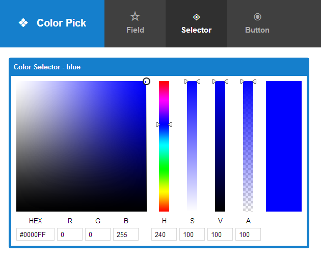
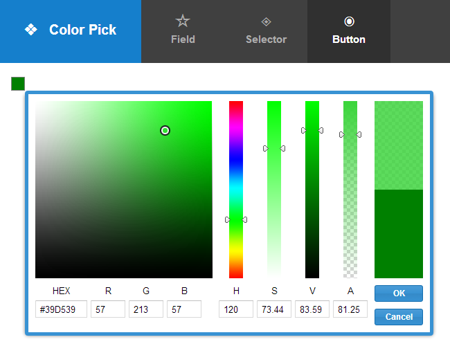

# ext-ux-colorpick

This package is brought to you by Sencha Professional Services. In this package
you will find three components.

Each of these components provide a "value" config that can be used in data binding
or directly. The value supports several common formats:

 * `hex6` - For example "ffaa00" (Note: does not preserve transparency).
 * `hex8` - For eaxmple "ffaa00ff" - the last 2 digits represent transparency
 * `#hex6` - For example "#ffaa00" (same as "hex6" but with a leading "#").
 * `#hex8` - For example "#ffaa00ff" (same as "hex8" but with a leading "#").
 * `HEX6` - Same as "hex6" but upper case.
 * `HEX8` - Same as "hex8" but upper case.
 * `#HEX6` - Same as "#hex6" but upper case.
 * `#HEX8` - Same as "#hex8" but upper case.

## colorfield

This is a form field component that displays the `colorselector` in a popup. It also
displays the current color in a swatch to the left of the value.

## colorselector

This component is the primary worker of the package. It is displayed in popup form
by the other components but in this example is fit inside a panel.

## colorbutton

This micro-sized component simply displays a color swatch and responds to clicks to
display the `colorselector` in a popup.

# Copyright

Copyright (c) 2014 Sencha Inc
All Rights Reserved

Contact:  http://www.sencha.com/contact

Pre-release code in the Ext repository is intended for development purposes only and will
not always be stable. 

Use of pre-release code is permitted with your application at your own risk under standard
Ext license terms. Public redistribution is prohibited.
