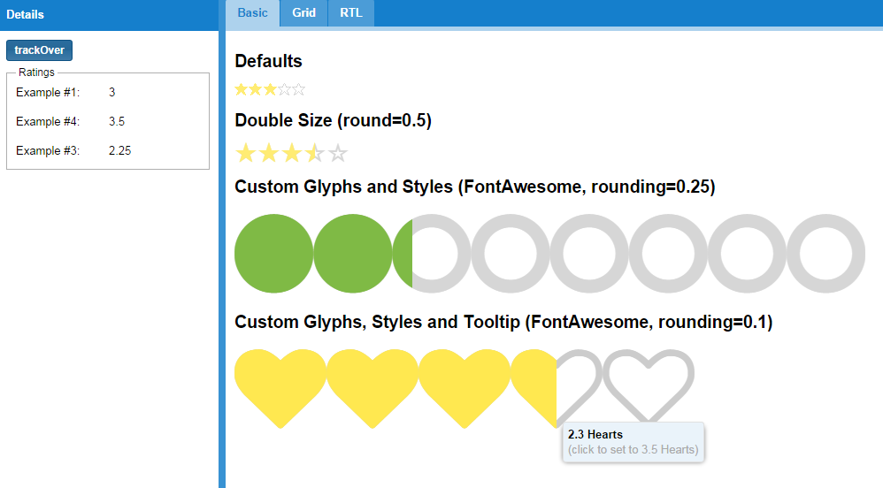
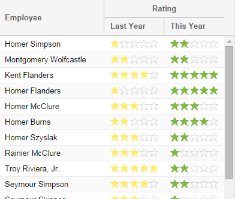

# ext-ux-rating

This package contains the `rating` widget. The `rating` widget is designed to
display a numeric rating using glyphs and allow the user to change the value
by clicking or tapping on the desired rating.

## Basic Usage

The `rating` widget can be used in standard containers:

    Ext.create({
        xtype: 'rating',
        renderTo: Ext.getBody(),
        value: 3
    });

The example application shows several differently configured instances:

## Grid Usage

It can also be used with the `widgetcolumn` in a grid:

# Copyright

Copyright (c) 2014 Sencha Inc
All Rights Reserved

Contact:  http://www.sencha.com/contact

Pre-release code in the Ext repository is intended for development purposes only and will
not always be stable. 

Use of pre-release code is permitted with your application at your own risk under standard
Ext license terms. Public redistribution is prohibited.
